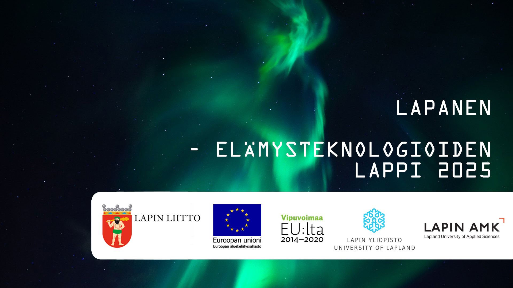

# Virtual City Tool
Tool for Unity to create simplified virtual maps based on data from OpenStreetMap.

# Version
v0.1a

# Guide
1. Easiest way is to place [OSMDATA] prefab into the scene. Prefab contains OSMReader, Plane and a camera.
2. OSMReader contains a OSMReader-script which is used to actually start generating the city. OSMReader needs a reference to a OSMEditorData-ScriptableObject for settings storage. First time this will be created automatically to the root of your project (Assets-folder). [OSMReader](#OSMReader) and [OSMEditorData](#OSMEditorData) settings are descriped in details below.
3. Generating the map
    * If you want to load data from the API, click **Generate Map (API)** button
    * If you have already donwloaded the data from OpenStreetMap (.osm), click the **Load and Generate Map from File** button, and browse the file.

## OSMReader
OSMReader only has one setting of it's own: API URL, which is the base URL for OpenStreetMap API query. The coordinates are then appended to this URL.

Rest of the settings are stored in the OSMEditorData-ScriptableObject but can be changed through OSMReader, or by modifying the OSMEditorData-object directly.

## OSMEditorData
OSMEditorData stores area specific generation settings. There are 4 sections of settings:
1. Area Coordinates: GPS coordinates of the area's bounds
2. Materials: Which materials are assigned to different world objects
3. Layers: Which layer is assigned to different world objects
4. Info Text Colors: What colours are used for info texts (TextMesh Pro texts)

## Camera settings
For the roads to generate correctly, the camera must be placed above the area looking down.

# Lapland Experience Technologies 2025
The long-term objective in this project is to make the potential of new experience technologies more noticeable andmore reachable to businesses in Lapland. The project’s primary objective for achieving this is to develop a digitaltoolbox for  VR/AR/MR ( VirtualReality, AugmentedReality/MixedReality ), that is designed based on the needs of thecompanies in the area, and that will enable faster and easier usage of the new experience technologies in their trade.The “experience technology toolbox” is distributed online for the companies to freely use. The tools that it contains areused to create two proof-of-concept demos. These demos are then introduced to companies for demonstrating their potential in business, and workshops are run with the companies to produce ideas and concepts of new products andservices that are based on the used experience technologies.The project enriches the cooperation between the companies, the public and the educational organisations in the area.The project also develops the cooperation between the ICT department of Lapland University of Applied Sciences, the Industrial design department of Lapland University and the Multidimensional Tourism Institute, and makes the possibilities of the cooperation more visible. The educational organisations also aim to improve the cooperation with the local companies by creating new relationships with them and by making the cooperation more multi-disciplined.

